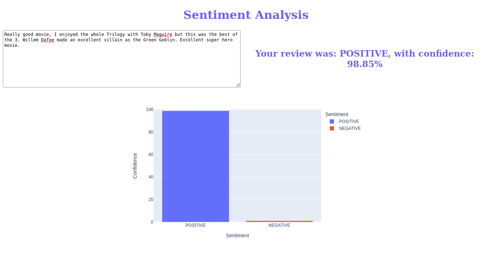
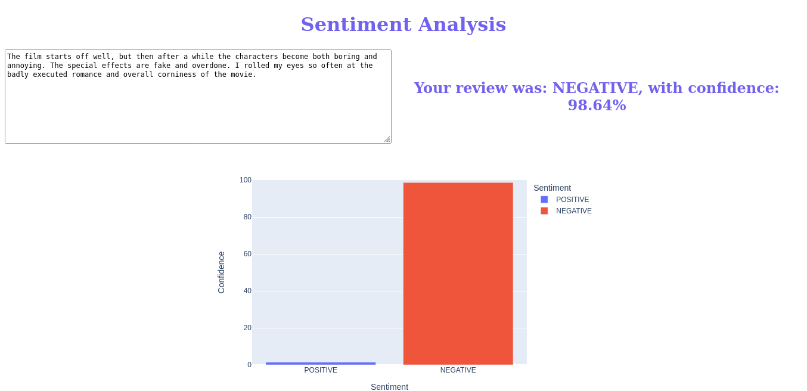

# Sentiment-Analysis
### Dagshub [repo](https://dagshub.com/elshehawy/sentiment-analysis).
### link to [demo](https://drive.google.com/file/d/1bXkXcs7dd73Tan7MuldMq3t6-J-Cgfyq/view?usp=sharing).
### link to [data](https://drive.google.com/drive/folders/1m1IKlvh3Zhm6Bx-qhqx7X01zLRuDcKqw) used in the notebook.

### To run the dockerized version of this app on you machine:

* [install docker](https://docs.docker.com/engine/install/) on your machine.
* download the 'dockerized' directory.
* open your terminal.
* change directory to the 'dockerized' directory
* run `docker build -t <your image name> .`
* run `docker create -p 1111:1111 --name <your container name> <your image name>`
* run `docker start <your container name>`
* open `http://localhost:1111/` in your browser

to stop the app:
run `docker stop <your container name>`

### Examples:
* positive example

* negative example

